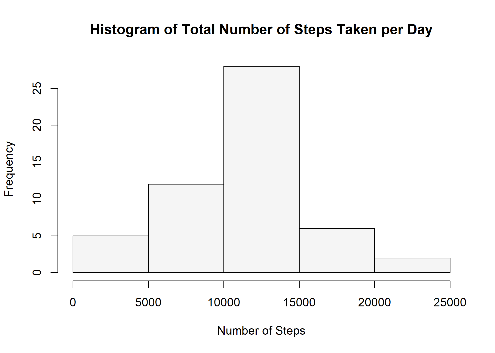
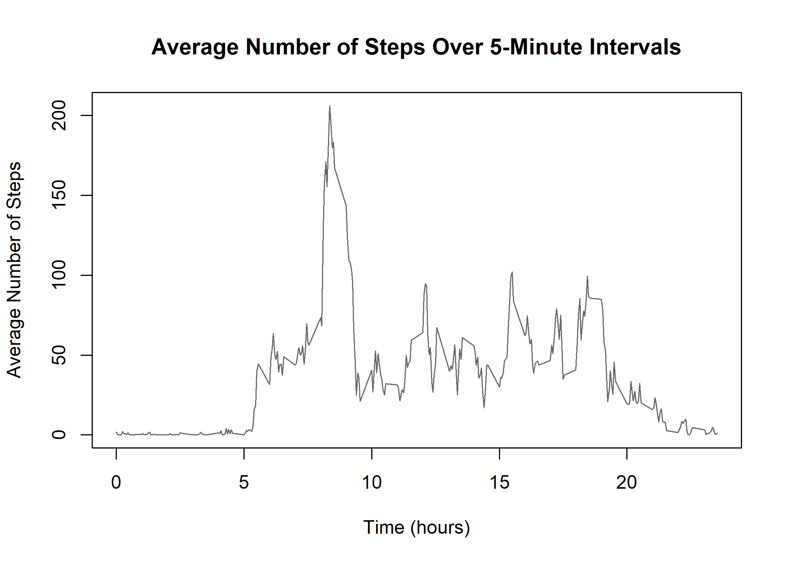
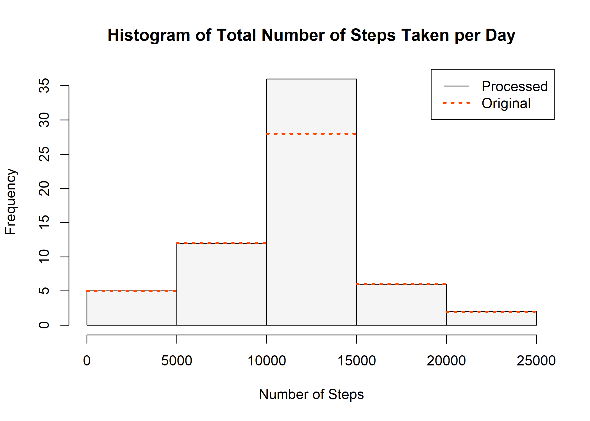
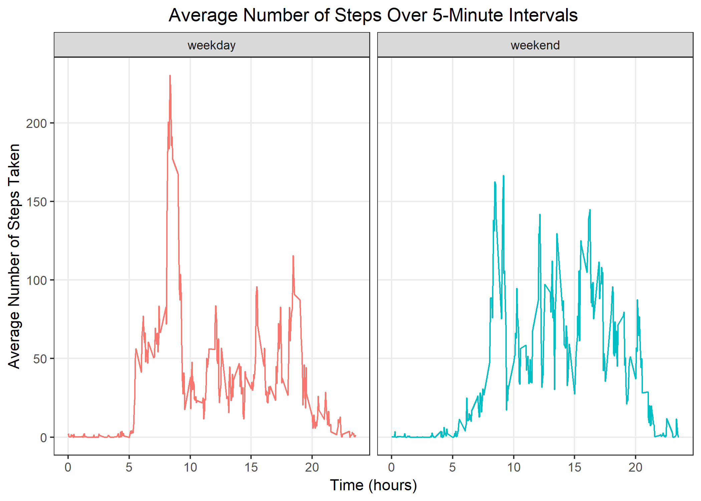

## Overview

The project makes use of data from a personal activity monitoring device. This device collects data at 5 minute intervals through out the day. The data consists of two months of data from an anonymous individual collected during the months of October and November, 2012 and include the number of steps taken in 5 minute intervals each day.

The variables included in this dataset are:

- **steps**: Number of steps taking in a 5-minute interval (missing values are coded as `NA`)
- **date**: The date on which the measurement was taken in `YYYY-MM-DD` format
- **interval**: Identifier for the 5-minute interval in which measurement was taken

The dataset has a total of 17,568 observations.

## Loading and preprocessing the data

The original data set is de-compressed first and then read into R using `read.csv` function. Variables are also specified to appropriate data types. 


```r
unzip("activity.zip")
activity <- read.csv("activity.csv", colClasses = c("integer", "Date", "integer"))
```

Loaded data has 17568 observations across 3 variables, among which 2304 have missing step values. Observations has a span of 60 days from 2012-10-01 to 2012-11-30, with 61 distinct dates. 

## What is mean total number of steps taken per day?

The following histogram shows the frequency of the daily total number of steps taken. 


```r
totalStepsPerDay <- aggregate(steps ~ date, activity, sum, na.rm = TRUE)
hist(totalStepsPerDay$steps, 
     col = "whitesmoke", 
     xlab = "Number of Steps", 
     main = "Histogram of Total Number of Steps Taken per Day")
```

<!-- -->

To find the central tendency of the distribution: 


```r
meanStepsPerDay <- mean(totalStepsPerDay$steps, na.rm = TRUE)
meanStepsPerDay
```

```
## [1] 10766.19
```

The mean total number of steps taken per day is approximately 10766. 


```r
medianStepsPerDay <- median(totalStepsPerDay$steps, na.rm = TRUE)
medianStepsPerDay
```

```
## [1] 10765
```

The median total number of steps taken per day is 10765.

The difference between mean and median is 1.19 step(s).

## What is the average daily activity pattern?

The following plot shows average number of steps taken over the days recorded at each 5-minute interval of the day.


```r
meanStepsPerInterval <- aggregate(steps ~ interval, activity, mean, na.rm = TRUE)
plot(steps ~ interval, 
     data = meanStepsPerInterval, 
     type = "l", 
     col = "dimgray", 
     xaxt = "n", 
     xlab = "Time (hours)", 
     ylab = "Average Number of Steps", 
     main = "Average Number of Steps Over 5-Minute Intervals")
axis(side = 1, at = 100 * seq(0, 24, by = 5), labels = seq(0, 24, by = 5))
```

<!-- -->

Among 288 5-minute intervals, on average across all the days in the dataset, the one that contains the maximum number of steps (206.17) is: 


```r
with(meanStepsPerInterval, interval[steps == max(steps)])
```

```
## [1] 835
```

## Imputing missing values

The total number of missing values in the dataset (steps coded as `NA`) is: 


```r
sum(is.na(activity$steps))
```

```
## [1] 2304
```

The adpoted strategy to fill these missing values in the dataset is to repalce `NA`s with the mean for that 5-minute interval. 


```r
completeActivity <- activity
completeActivity$intervalMean <- with(completeActivity, ave(interval, date, FUN = function(x) with(meanStepsPerInterval, steps[interval == x])))
completeActivity$steps <- with(completeActivity, ifelse(is.na(steps), intervalMean, steps))     
completeActivity <- subset(completeActivity, select = -c(intervalMean))
```

The following histogram compares the frequency of the daily total number of steps computed from both the original dataset with missing values and the processed dataset. 


```r
completeTotalStepsPerDay <- aggregate(steps ~ date, completeActivity, sum)
hist(completeTotalStepsPerDay$steps, 
     col = "whitesmoke", 
     xlab = "Number of Steps", 
     main = "Histogram of Total Number of Steps Taken per Day")
originalHist <- hist(totalStepsPerDay$steps, plot = FALSE)
segments(x0 = originalHist$breaks[1:length(originalHist$breaks) - 1], 
         x1 = originalHist$breaks[2:length(originalHist$breaks)], 
         y0 = originalHist$counts, 
         y1 = originalHist$counts, 
         col = "orangered", 
         lty = "dotted", 
         lwd = 2.5)
legend("topright", 
       col = c("black", "orangered"), 
       lty = c("solid", "dotted"), 
       lwd = c(1, 2.5), 
       legend = c("Processed", "Original"))
```

<!-- -->

Mean and median total number of steps taken per day from the processed dataset are: 


```r
completeMeanStepsPerDay <- mean(completeTotalStepsPerDay$steps)
completeMeanStepsPerDay
```

```
## [1] 10766.19
```

The mean total number of steps taken per day is approximately 10766.

The difference from the original mean is 0.00 step(s).


```r
completeMedianStepsPerDay <- median(completeTotalStepsPerDay$steps)
completeMedianStepsPerDay
```

```
## [1] 10766.19
```

The median total number of steps taken per day is 10766.

The difference from the original median is 1.19 step(s).

## Are there differences in activity patterns between weekdays and weekends?

The first step to finding potential activity patterns is to distinguish weekdays and weekends. A new factor variable is added to the processed datasets, with 2 levels of `weekday` and `weekend`, to indicate whether a given date is a weekday or weekend day. 


```r
completeActivity$dayType <- as.factor(ifelse(grepl("^S(at|un)", weekdays(completeActivity$date)), "weekend", "weekday"))
completeMeanStepsPerInterval <- aggregate(steps ~ interval * dayType, completeActivity, mean)
```

The following panel plot of two time-series shows difference in activity patterns between weekdays and weekends based on average number of steps taken across 5-minute interval from all days of the same type. 


```r
library(ggplot2)
g <- ggplot(completeMeanStepsPerInterval, aes(interval, steps, col = dayType)) +
    geom_line() + 
    facet_grid(. ~ dayType) + 
    scale_x_continuous(breaks = 100 * seq(0, 24, by = 5), labels = seq(0, 24, by = 5)) + 
    theme_bw() + 
    theme(panel.grid.minor = element_blank(), plot.title = element_text(hjust = 0.5), legend.position="none") +
    labs(title = "Average Number of Steps Over 5-Minute Intervals") + 
    labs(x = "Time (hours)", y = "Average Number of Steps Taken")
print(g)
```

<!-- -->
